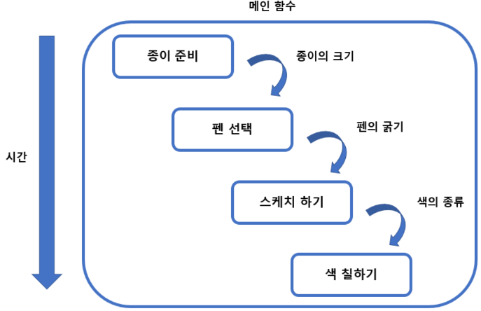
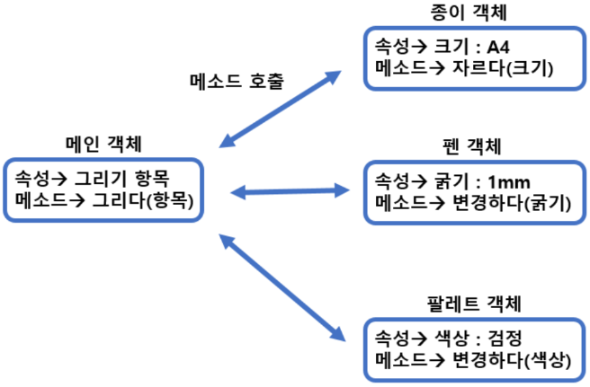
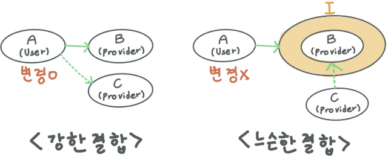

# ⭐ 절차적 vs 객체지향 프로그래밍

## 💫 절차적 프로그래밍(Procedual Programming)

- 시간의 흐름에 따라 코드 작성
    
    
    
- 여러명이 개발하는 대규모 프로그램이나 자주 수정되는 프로그램을 만들 때 복잡 ⇒ 객체지향 언어 발전
- 대표 언어: C언어, 포트란, 알골, 베이직 등

        

## 💫 객체지향 프로그래밍(Object-Oriented Programming)

- 독립된 객체 간 소통 중시
    
    
    
- 프로그램이 복잡해지더라도 객체 단위로 수정이 용이하고, 오류 발생 시 문제가 있는 클래스 중심으로 원인 파악 후 해결이 쉬움
- 대표 언어: 자바, C++, C# 등


# ⭐ 오버로딩 vs 오버라이딩

- 필요성: 객체지향의 다형성


## 💫 오버로딩: 새로운 메서드를 정의

- 키워드: new
- 성립조건: 메서드 이름, 매개변수의 개수/타입 달라야함, 반환타입 영향없음
- 적용 범위: 상속관계

### 오버로딩 X

```java
class OverloadingTest {
	int add(int a, int b) {	// 에러
		return a + b;
	}
	
	int add(int a, int b) {	// 에러
		return a + b;
	}
}
```

### 오버로딩 O

```java
class OverloadingTest {
	int add(int a, int b) {
		return a + b;
	}
	
	int add(int a, int b, int c) {
		return a + b + c;
	}
	
	double add(double a, double b) {
		return a + b;
	}
}
```

### Quiz

```java
class Parent {
	void parentMethod() {}
}

class Child extends Parent {
	void parentMethod() {}		  // 1번
	void parentMethod(int i) {}	  // 2번
	
	void childMethod() {} 	      // 3번
	void childMethod(int i) {}	  // 4번
	void childMethod() {}		  // 5번
}
```

## 💫 오버라이딩: 메서드 재정의

- 키워드: @Override
- 성립조건: 메서드 이름, 매개변수/타입, 반환타입 일치
- 적용 범위: 같은 클래스 내

```java
class Point {
	int x;
	int y;
	
	String getLocation() {
		return "x: " + x + ", y: " + y;
	}
}

class Point3D extends Point {
	int z;
	
	String getLocation() {
		return "x: " + x + ", y: " + y + ", z: " + z;
	}
}
```

# ⭐ this  vs  this()

## 💫 참조변수 this

- 인스턴스 자신을 가르키는 참조변수로 인스턴스의 주소가 저장됨
- new 연산자가 인스턴스에 할당할 때 활성화됨

## 💫 생성자 this()

- 자신 클래스의 생성자 호출

## 💫 예시

```java
public class ThisEx {
	String country;
	String capital;
	int population;
	
	public ThisEx() {
		this.country = "France";
		this.capital = "paris";
		this.population = 10;
	}
	
	public ThisEx(String capital, int population) {
		this("UK", capital, population);
	}
	
	public ThisEx(String country, String capital, int population) {
		this.country = country;
		this.capital = capital;
		this.population = population;
	}
	
	@Override
	public String toString() {
		return "country: " + this.country + ", capital: " + this.capital 
						+ ", population: " + this.population;
	}
	
	public static void main(String[] args) {
		ThisEx c1 = new ThisEx();
		System.out.println(c1);
		
		ThisEx c2 = new ThisEx("Italy", "Rome", 20);
		System.out.println(c2);
		
		ThisEx c3 = new ThisEx("London", 15);
		System.out.println(c3);
	}
 }
```

# ⭐ super  vs  super()

## 💫 참조변수 super (≑ this)

- 객체 자신을 가리키는 참조변수로 인스턴스메서드(생성자)내에서만 존재

```java
public class RefVariableSuper {
	public static void main(String[] args) {
		Child c = new Child();
		c.method();
	}
}

class Parent {
	int x = 10;
}

class Child extends Parent {
	int x = 20;
	
	void method() {
		System.out.println("x: " + x);
		System.out.println("this.x: " + this.x);
		System.out.println("super.x: " + super.x);
	}
}
```

## 💫  생성자 super()

- 조상의 생성자를 호출할 때 사용(생성자와 초기화블럭은 상속 안됨)
- Object 클래스를 제외한 모든 클래스의 **생성자 첫줄에 반드시 생성자 this() / super()  호출**

```java
public class ConstructorSuper {
	public static void main(String[] args) {
		Point3D p3 = new Point3D();
		
		System.out.println("p3.x: " + p3.x);
		System.out.println("p3.y: " + p3.y);
		System.out.println("p3.z: " + p3.z);
	}
}

class Point {
	int x = 10;
	int y = 20;
	
	Point(int x, int y) {
		this.x = x;
		this.y = y;
	}
}

class Point3D extends Point {
	int z = 30;
	
	Point3D() {
		this(100, 200, 300);
	}
	
	Point3D(int x, int y, int z) {
		super(x, y);
		this.z = z;
	}
}
```

## ⭐ 추상클래스 vs 인터페이스

### 💫 공통점

- 추상메서드 사용 가능

### 💫 차이점

| 추상클래스 | 인터페이스 |
| --- | --- |
| 추상 메서드를 가진 일반 클래스 | 추상메서드 빼고 구현된 것이 아무것도 없음 |
| 다중상속 불가능 | 다중 상속 가능 |
| 일반메서드 + 추상메서드 가능 | 추상메서드만 가능 |
| 일반변수 + 일반 메서드 + 추상메서드 | 상속 + 추상메서드 |
| 생성자와 일반변수 모두 가질 수 있음 | 생성자와 일반변수 가질 수 없음 |
| extends | implements |
| 메서드 부분적인 구현 가능 | 메서드 선언만 가능 |

### 💫 추상클래스

- 다른 클래스 작성에 도움을 주기 위한 것으로 인스턴스 생성 불가
- 추상메서드: 선언부만 작성하고 구현부가 없는 메서드

```java
abstract class 추상클래스 {
  int val;      // 일반 변수
  추상클래스(){} // 생성자
  public void 일반메서드() {}

  public abstract void 추상메서드(); 
  (default 생략가능) abstract void 추상메서드2(); 
}

class A extends 추상클래스 {
  public void 추상메서드() {
      // 추상메서드 구현 필수
  }
  
  void 추상메서드2() {
      // 추상메서드 구현 필수
  }
}
```

### 💫 인터페이스

- **추상메서드의 집합**
- 구현된 것이 전혀 없는 설계도, 껍데기(모든 멤버가 public)

```java
interface 인터페이스 {
  (public static final 생략가능) int 상수이름 = 값;
  (public abstract 생략가능) void 추상메서드();

  default void 디폴트메서드(){
		// 구현
  }
}
 
class A implements 인터페이스 {
  void 추상메서드(){
		// 추상메서드 구현 필수
	}
}
```

- 장점
    - 느슨한 결합으로 변경에 유리한 설계 가능
    
    
    
    - 개발시간 단축 가능
    - 표준화 가능( jdbc: 인터페이스 집합)
    - 서로 관계없는 클래스들을 관계맺어줄 수 있음

# ✅ Ref.

[https://post.naver.com/viewer/postView.nhn?volumeNo=29654748&memberNo=6255089&searchKeyword=단순생활&searchRank=269](https://post.naver.com/viewer/postView.nhn?volumeNo=29654748&memberNo=6255089&searchKeyword=%EB%8B%A8%EC%88%9C%EC%83%9D%ED%99%9C&searchRank=269)

[https://blog.naver.com/queen0326/222457388279](https://blog.naver.com/queen0326/222457388279)

[https://private.tistory.com/20](https://private.tistory.com/20)

[https://fora.tistory.com/16](https://fora.tistory.com/16)

[https://steadycode.tistory.com/61](https://steadycode.tistory.com/61)
