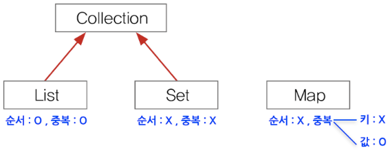
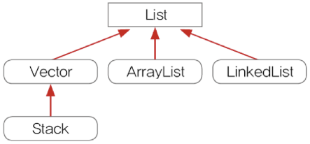
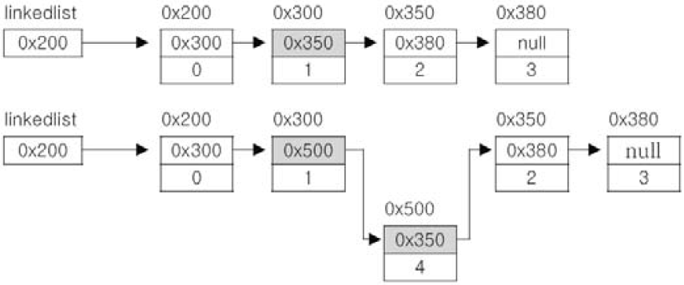
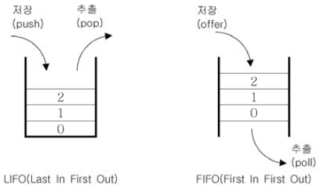
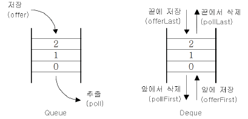
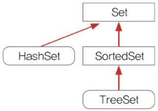
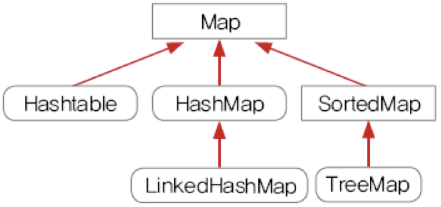

# ❤️ 컬렉션 프레임워크

### 💫 컬렉션 (Collection)

- 여러 객체 (데이터)를 모아 놓은 것을 의미

### 💫 프레임워크 (Framework)

- 표준화, 정형화된 프로그래밍 방식

### 💫 컬렉션 프레임워크 (Collection Framework)

- 데이터 군을 저장하는 클래스들을 표준화한 설계
- 프로그램 구현에 필요한 자료구조(Data Structure)를 구현해 놓은 JDK 라이브러리
- 모든 자바 컬렉션은 java.util 패키지에 구현
- 개발에 소요되는 시간을 절약하면서 최적화된 알고리즘을 사용 가능

## 🎇 컬렉션 프레임워크의 핵심 인터페이스



## 🎇 Collection 인터페이스

- 컬렉션을 다루는데 가장 기본적인 메서드들을 정의
- 하나의 객체를 관리하기 위한 메서드가 선언된 인터페이스
- 하위에 List와 Set 인터페이스가 있음

# ⭐ List

## 🎇 List 인터페이스

- 저장 순서가 유지되면서 중복을 허용하는 컬렉션을 구현하는데 사용

  

### 💫 Vector

- 동기화된 메소드로 구성되어 멀티 쓰레드 환경에서 안전하게 객체를 추가/삭제 가능
- ArrayList와 동일한 내부 구조

### 💫 ArrayList

- 기존 Vector를 개선한 것으로, 가능하면 Vector보다 **ArrayList**를 사용
- Object 배열을 이용해서 데이터의 저장순서가 유지되고 중복을 허용
- 삭제 진행시 데이터의 저장순서가 유지되기 때문에 마지막 데이터를 삭제하는 경우가 아니라면, arraycopy가 발생된다. 데이터를 옮기는 작업을 거치기 때문에 데이터가 많을수록 수행시간이 오래걸린다.
- 예시
    
    ```java
    import java.util.ArrayList;
    
    public class ArrayListEx {
    	public static void main(String[] args) {
    		ArrayList al = new ArrayList();
    		
    		// 값 추가 - add()
    		al.add("A"); al.add("B");
    		al.add("D"); al.add("E");
    		
    		System.out.println(al);  // [A, B, D, E]
    
    		// 특정 index에 값 추가 - add(index, Eelement)
    		al.add(2, "C");
    		System.out.println(al);  // [A, B, C, D, E]
    		
    		// 값 변경 - set()
    		al.set(1, "b");
    		System.out.println(al);  // [A, b, C, D, E]
    
    		// 값 삭제 - remove(), clear()
    		al.remove(1);	// 첫번째 요소 삭제
    		System.out.println(al);  // [A, C, D, E]
    		
    		al.remove("D");	// D 삭제
    		System.out.println(al);  // [A, C, E]
    		
    		// 값 읽기
    		System.out.println(al.get(0));  // A
    		System.out.println(al.get(1));  // C
    		System.out.println(al.get(2));  // E
    		
    		// 전체 삭제
    		al.clear();
    		System.out.println(al);  // []
    	}
    }
    ```
    

### 💫 LinkedList

- 배열의 단점을 보완하기 위해 고안된 자료구조
- 불연속적으로 존재하는 데이터를 서로 연결한 형태로 구성
    
    
    
    ```java
    class Node {
    	Node next;    // 다음 요소의 주소 저장
    	Object obj;   // 데이터 저장
    }
    ```
    
- **추가**: 추가하고자 하는 위치의 이전 요소의 참조를 새로운 요소에 대한 참조로 변경해주고, 새로운 요소가 그 다음 요소를 참조하도록 변경
    
    
    
- **삭제**: 삭제하고자 하는 요소의 이전 요소가 삭제하고자 하는 요소의 다음 요소를 참조하도록 변경
    
    
    
- **더블 링크드 리스트**(이중 연결 리스트, doubly linked list): 링크드리스트 보완
    
    
    
    ```java
    class Node {
    	Node next;      // 다음 요소의 주소 저장
    	Node previous;  // 이전 요소의 주소 저장
    	Object obj;     // 데이터 저장
    }
    ```
    
- 더블 써큘러 링크드 리스트(이중 원형 연결 리스트, doubly circular linked list): 더블 링크드 리스트의 접근성 향상
    
    
    

### ✅ ArrayList  vs  LinkedList 성능 비교

| <center>성능 비교</center> | ArrayList   | LinkedList  |
| :---: | :---: | :---: |
| 순차적으로 데이터를 추가/삭제 | 👍🏻 |  |
| 비순차적으로 데이터를 추가/삭제 |  | 👍🏻 |
| 접근 시간 | 👍🏻 |  |

## 🎇 Stack & Queue

- Stack: 마지막에 저장한 데이터를 가장 먼저 꺼내게 되는 **LIFO** 구조 ⇒ ArrayList
- Queue: 처음에 저장한 데이터를 가장 먼저 꺼내게 되는 **FIFO** 구조 ⇒ LinkedList

  

## 🎇 Queue의 변형

### 💫 PriorityQueue

- Queue 인터페이스의 구현체 중 하나로, 저장한 순서에 관계 없이 우선순위가 높은 것부터 꺼냄
- null 저장 불가
- 저장 공간으로 배열을 사용하며, 각 요소를 힙(Heap)이라는 자료구조의 형태로 저장

### 💫 Deque(Double-Ended Queue)

- Queue의 변형으로, 양쪽 끝에 저장(offer)/삭제(poll) 가능
    
  
    

## 🎇 Iterator, LisIterator, Enumaration

- 컬렉션에 저장된 데이터를 접근하는데 사용되는 인터페이스

### 💫 Iterator

- 컬렉션에 저장된 요소들을 읽어오는 방법을 표준화
- 컬렉션에 iterator()를 호출해서 Iterator를 구현한 객체를 얻어서 사용

### 💫 Collection 요소를 순회하는 Iterator

- 컬렉션 프레임워크에 저장된 요소들을 하나씩 차례로 참조하는 것
- 순서가 있는 List 인터페이스의 경우는 Iterator 를 사용하지 않고 get(i) 메서드를 활용할 수 있음
- Set 인터페이스의 경우 get(i) 메서드가 제공되지 않으므로 Iterator를 활용하여 객체를 순회

Iterator 사용하기

- boolean hasNext() : 이후에 요소가 더 있는지를 체크하는 메서드
- 요소가 있다면 true 를 반환하고 없으면 false 를 반환 한다.

### 💫 Enumaration

- Iterator의 이전 버전으로, 가능하면 Enumaration보다 Iterator를 사용

### 💫 ListIterator

- Iterator의 접근성 향상 (단방향 →양방향)
- List 인터페이스를 구현한 컬렉션 클래스에서만 사용 가능

## 🎇 Arrays

- 배열을 다루기 편리한 메서드(static) 제공
    - 배열의 복사 - copyOf(), copyOfRange()
    - 배열 채우기 - fill(), setAll()
    - 배열의 정렬과 검색 - sort(), binarySearch()
    - 배열을 List로 변환 - asList(Object… a)
    - parallelXXX(), spliterator(), stream()

## 🎇 Comparator, Comparable

- 객체 정렬에 필요한 메서드를 정의한 인터페이스 ⇒ 정렬 기준 제공
- Comparator: 기본 정렬기준을 구현하는데 사용
- Comparable: 기본 정렬기준 외 다른 기준으로 정렬할 때 사용

# ⭐ Set

## 🎇 Set 인터페이스

- 저장 순서가 유지되지 않으면서 중복을 허용하지 않는 컬렉션 클래스를 구현하는데 사용
    - 순서 x, 중복 x

    

- Set의 저장: Set의 모든 요소를 List에 담아서 Collection.sort()로 정렬

### 💫 HashSet

- Set 인터페이스를 구현한 대표적인 컬렉션 클래스
- 순서 유지 ⇒ LinkedHashSet 클래스 사용
- 객체 저장 전 같은 객체가 있는지 확인 ⇒ 그래야 중복된걸 저장 안할 수 있음
- 메서드 중 boolean add(Object o)는 저장할 객체의 equals()와 hashCode()를 호출하는데,
    
    equals()와 hashCode()가 오버라이딩 되어있어야 함
   
    

### 💫 TreeSet

- 이진 탐색 트리(binary search tree)로 구현된 컬렉션 클래스
    - 이진 탐색 트리(binary search tree)
        - 여러 개의 노드가 서로 연결된 구조로, 각 노드에 최대 2개의 노드 연결 가능
        - 데이터가 많아질수록 데이터 추가/삭제에 시간이 더 걸림
            
            
            
- 범위 검색과 정렬에 유리

# ⭐ Map

## 🎇 Map 인터페이스

- 저장순서가 유지되지 않으면서 키와 값을 하나의 쌍으로 묶어 저장하는 컬렉션 클래스를 구현하는데 사용
    - 키는 중복될 수 없지만, 값은 중복을 허용

    

### 💫 Hashtable

- HashMap의 이전 버전으로, 가능하면 Hashtable보다 HashMap을 사용

### 💫 HashMap

- Map 인터페이스를 구현한 대표적인 컬렉션 클래스
- 순서 유지 ⇒ LinkedHashMap 클래스 사용
- HashMap의 키(key)와 값(value)
    - 해싱(hashing)기법으로 데이터를 저장 ⇒ 데이터가 많아도 검색이 빠름
    - 데이터를 키와 값 쌍으로 저장
        - 키: 컬렉션 내 키 중 유일해야됨
        - 값: 데이터 중복 허용

### 💫 Hashing

- 해시 함수로 해시테이블에 데이터를 저장하고 검색하는 기법
- 해시테이블: 배열 + 링크드리스트
- 해시테이블에 저장된 데이터를 가져오는 과정
    1. 키로 해시함수롤 호출해서 해시코드를 얻음
    2. 해시코드(해시함수의 반환값)에 대응하는 링크드리스트를 배열에서 찾음
    3. 링크드리스트에서 키와 일치하는 데이터 찾기
        - 해시함수는 같은 키에 대해 항상 같은 해시코드를 반환해야 함
            
            서로 다른 키일지라도 같은 값의 해시코드를 반환활 수도 있음
            

### 💫 TreeMap (= TreeSet)

- 이진 탐색 트리의 구조로 키와 값의 쌍으로 이루어진 데이터를 저장
- 범위 검색과 정렬에 유리한 컬렉션 클래스


### ✅Ref

- [도서] 자바의정석 3판 / 남궁성
- [pdf] 자바의정석 basic 요약집 / 남궁성
- [블로그] [https://kevinntech.tistory.com/16](https://kevinntech.tistory.com/16)
- [공식문서] [https://docs.oracle.com/en/java/javase/11/docs/api/java.base/java/util/package-summary.html](https://docs.oracle.com/en/java/javase/11/docs/api/java.base/java/util/package-summary.html)